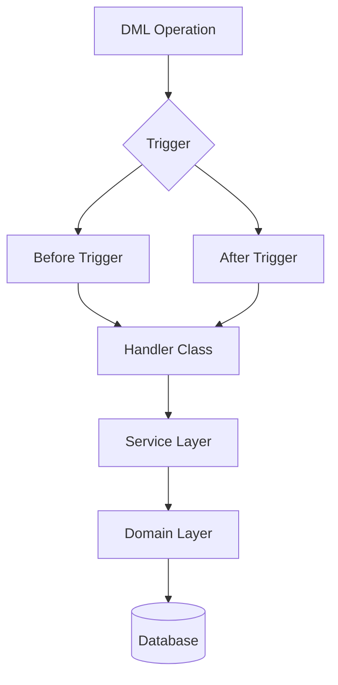

# Apex Triggers

Apex triggers are powerful tools for executing custom logic in response to data manipulation language (DML) operations in Salesforce.

## Overview

/// info | Key Concept
Apex triggers execute before or after specific DML operations like insert, update, delete, or undelete events on Salesforce objects.
///

Triggers are essential for maintaining data integrity and implementing complex business logic.

## Trigger Context Variables

The following context variables are available in triggers:

/// tab | Trigger.new
```apex
// Access the list of new records
for(Account acc : Trigger.new) {
    System.debug('New Account: ' + acc.Name);
}
```
///

/// tab | Trigger.old
```apex
// Access the list of old records
for(Account acc : Trigger.old) {
    System.debug('Old Account: ' + acc.Name);
}
```
///

/// tab | Trigger.newMap
```apex
// Access the map of new records by Id
Map<Id, Account> newAccounts = Trigger.newMap;
System.debug('New Account Name: ' + newAccounts.get(someId).Name);
```
///

## Best Practices

/// danger | Anti-Pattern Warning
Never place SOQL queries inside loops in your triggers! This can quickly exceed Salesforce governor limits.
///

Here's an example of a well-structured trigger:

```apex {linenums="1" hl_lines="5-7 12"}
trigger AccountTrigger on Account (before insert, before update) {
    // Call handler class to execute logic
    AccountTriggerHandler.handleBeforeInsert(Trigger.new);
    
    // Example of a bad practice (don't do this):
    for(Account acc : Trigger.new) {
        List<Contact> contacts = [SELECT Id FROM Contact WHERE AccountId = :acc.Id]; // WRONG!
    }
    
    // Correct approach:
    Set<Id> accountIds = new Set<Id>();
    for(Account acc : Trigger.new) {
        accountIds.add(acc.Id);
    }
    List<Contact> contacts = [SELECT Id, AccountId FROM Contact WHERE AccountId IN :accountIds];
}
```

## Trigger Framework Diagram



## Bulkification

Designing triggers to handle bulk operations is essential in Salesforce. Here's a comparison of approaches:

| Approach | Pros | Cons |
|----------|------|------|
| Individual Record Processing | Simple to understand | Not scalable |
| Bulk Processing | Efficient, handles governor limits | More complex code |
| Handler Pattern | Organized, testable | Requires more files |

## Related Topics

- [Test Classes](../test_classes.md)
- [Code Coverage](../code_coverage.md)
- [Apex Code Standards](../apex_code.md)
